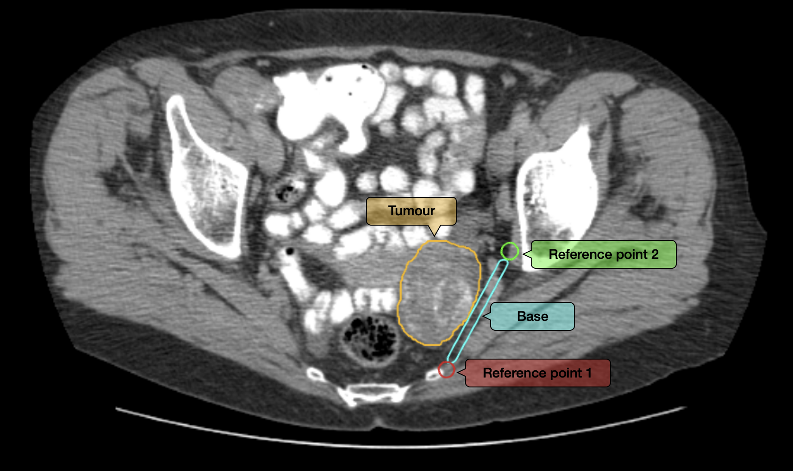

[](https://www.repostatus.org/#inactive)
[](https://github.com/psf/black)
[](https://www.python.org/downloads/)

#  3D Moulds for Ovarian Cancer

Repository for the publication "Lesion-Specific 3D-Printed Moulds for Image-Guided Tissue Multi-Sampling of Ovarian Tumours: a prospective pilot study"

## Dependencies
The code in this repository runs on Python and has been developed and tested using Python 3.8.13. Necessary libraries and versions are in the [requirements.txt](requirements.txt) file. Required libraries can be installed by running:
```bash
pip install -r requirements.txt
```

## Inputs
* [**dicom\_info.yaml**](dicom_info.yaml): yaml file specifying:
  1. Path to the folder that contains both the DICOM images files and the DICOM-RT file.
  2. Names given to the ROIs (tumour, base, reference points) in the DICOM-RT file.
  |  |
  |:---:|
  | *Required ROIs are: the tumour (delineated on every slice where the lesion appears) and the desired location of the base, together with two reference points at the end of it as shown in the figure. The base and reference points need to be segmented only on a few slices (e.g. 5).* |
* [**tunable\_parameters.yaml**](tunable_parameters.yaml): yaml file specifying the values each of tunable parameter illustrated in Figure X of the manuscript.

Empty templates (or filled with suggested values for *tunable_parameters.yaml*) of both files are provided.

## Outputs
All the results will be stored in a folder named *your-mould-id*:
* **mould\_your-mould-id.scad**: SCAD file of the generated mould.
* **tumour\_replica\_your-mould-id.stl**: STL file of the tumour replica.
* **tumour\_slices\_outlines**: A subfolder with the contours of each tumour slice. The images are png and have the dimensions of the expected sample. Each image filename is the tissue slice number in the mould followed by the corresponding DICOM slice number.
* **tumour\_w\_spikes\_your-mould-id.stl**: STL file of the tumour replica that has been modified by replacing the areas above the widest surface by the tumour convex hull on the xy plane so the mould does not close above it (shown in Figure X of the manuscript). *ATTN: This file needs to be in the same directory as the SCAD mould because it is used for its generation.*
* **yaml\_inputs**: A subfolder with the yaml files used for the mould generation.

Optionally, the pre-processed tumour replica or intermediate SCAD files of the independent structures of the mould can be saved, as explained below (Usage, Flags). The filenames of these are self-explanatory.

## Usage
`run.py` is the main script. It is composed of different parts that handle inputs import, DICOM re-slicing and rotation, transformation from DICOM to World Coordinate System (WCS) and tumour and mould modelling. This script connects all the steps in the pipeline and calls to specific functions defined in [utils](utils).

```bash
python run.py your-mould-id [OPTIONS] [FLAGS]
```

A string of your mould ID is the only required input (i.e. if happy with the default values you can simply run ```python run.py your-mould-id```). Additionally, there are multiple options (with default values) and flags that can be passed to this script.
### Options:
-  `--tunable_parameters PATH ` Path to the yaml file specifying the tunable parameters. By default, this is simply *tunable\_parameters.yaml* and calls to file under this name in the working directory.
-  `--dicom_info PATH         ` Path to the yaml file specifying the DICOM information. By default, this is simply *dicom\_info.yaml* and calls to file under this name in the same directory as the code.
-  `--results_path PATH       ` Path to the folder where to save the results. A subfolder under your-mould-id will be created. By default, this corresponds to a folder called *results* in the working directory.
-  `-h                        `  Show this help message and exit.

### Flags:
-  `--display                 ` If added, the code displays the masks for the ROIs before and after rotation.
-  `--save_preproc            ` If added, the code saves the tumour stl mesh before smoothing.
-  `--save_scad_intermediates ` If added, the code saves the scad files of each individual parts of the mould (i.e. the mould cavity, mould cavity + baseplate, slicing guide, orientation guides, and complete mould without slits).

## Post-processing
Most 3D printing softwares require a STL as input. Below are the instructions to convert the mould SCAD file to STL and to fix the appearance of the tumour replica if required.

### SCAD to STL Conversion
#### Dependencies
*  [**OpenSCAD**](https://openscad.org/downloads.html)

#### Instructions
1. Open the mould SCAD file.
2. Design > Render
3. File > Export > Export as STL...

### Tumour replica STL Fixing
If you wish to print the tumour replica, you may sometimes observe the file cannot be printed as it contains holes. Below are some instructions with open source software packages to fix it.

#### Dependencies
* [**PrusaSlicer**](https://www.prusa3d.com/page/prusaslicer_424/)
* [**Meshmixer**](https://meshmixer.com/download.html)

#### Instructions
1. On **PrusaSlicer**:
    1. Click on File > Repair STL file... and import the STL tumour replica. It will be saved as an OBJ file.
1. On **MeshMixer**:
    1. Import OBJ file
    2. Edit > Make solid > Accept
    3. File > Export and save it as STL.
